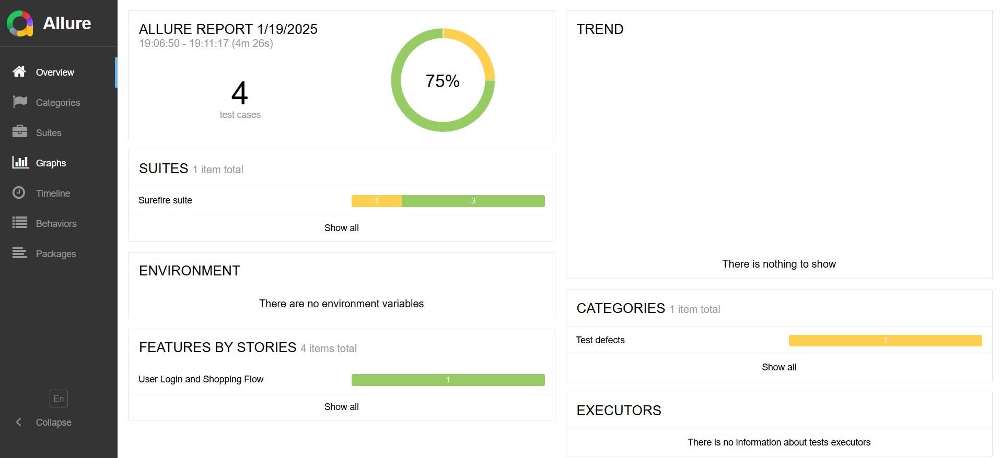
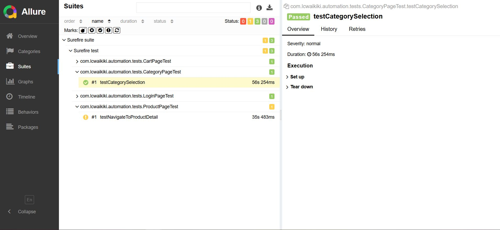
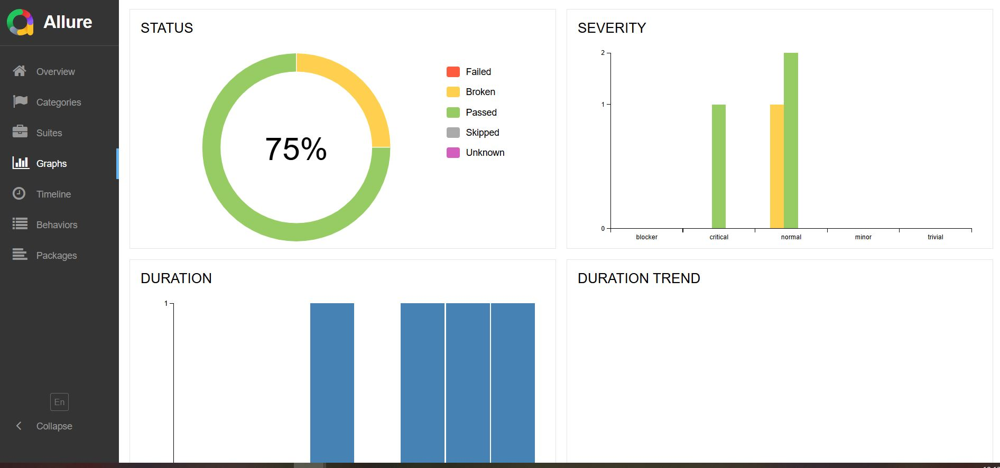

# LC Waikiki Test Otomasyon Bitirme Projesi
- Bu proje, LC Waikiki web sitesindeki temel kullanıcı etkileşimlerini otomatikleştirmek için geliştirilmiştir.

## Projem Hakkında
Bu proje, Selenium ve TestNG kullanılarak, LC Waikiki web sitesindeki alışveriş akışını otomatikleştirmek için geliştirilmiştir.  
Temel olarak şu işlevleri içermektedir:
- Kullanıcı girişi yapma
- Ürün seçimi ve filtreleme
- Sepete ürün ekleme ve doğrulama
- Favorilere ürün ekleme
- Test sonuçlarını Allure Report ile raporlama

## Kullandığım Teknolojiler
- **Java**
- **Selenium WebDriver**
- **TestNG**
- **Maven**
- **Allure Report**

## Projemin Sayfa Yapısı

LCWaikikiAutomation/

├── allure-result    # allure rapor sonuçlarımız

├── src/main/java  
│   ├── pages/         # Sayfa nesne modeli sınıfları   
├── src/test/java  
│   ├── tests/       # Test senaryoları  
├── pom.xml          # Maven yapılandırma dosyası  
├── ReadME.md        # Proje açıklaması

## Projemden Görseller

- Allure-result raporumdan birkaç görseli aşağıya bırakıyorum.

******

******

